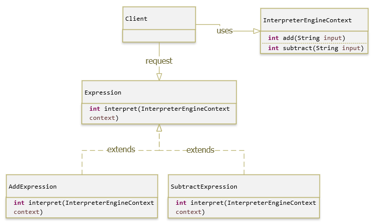

# Interpreter Pattern - Behavioral Pattern
>Given a language, define a representation for its grammar along with an interpreter that uses the representation to interpret sentences in the language.
Interpreter là một design pattern ít được sử dụng nhất vì tính đặc thù của nó.

Theo định nghĩa, nó được sử dụng để định nghĩa một biểu diễn ngữ pháp cho một ngôn ngữ và cung cấp một Thông dịch viên để xử lý ngôn ngữ này.

1. Interpreter Pattern là một trong những Pattern thuộc nhóm hành vi (Behavior Pattern).

2. Interpreter nghĩa là thông dịch, mẫu này nói rằng “để xác định một biểu diễn ngữ pháp của một ngôn ngữ cụ thể, cùng với một thông dịch viên sử dụng biểu diễn này để diễn dịch các câu trong ngôn ngữ”.

Nói cho dễ hiểu, Interpreter Pattern giúp người lập trình có thể “xây dựng” những đối tượng “động” bằng cách đọc mô tả về đối tượng rồi sau đó “xây dựng” đối tượng đúng theo mô tả đó.

Metadata (mô tả) –> [Interpreter Pattern] –> Đối tượng tương ứng.

Interpreter Pattern có hạn chế về phạm vi áp dụng. Mẫu này thường được sử dụng để định nghĩa bộ ngữ pháp đơn giản (grammar), trong các công cụ quy tắc đơn giản (rule), …

- Ví dụ đơn giản nhất của nó là Google Translate, chỉ cần nhập vào một đoạn tiếng Việt và bụp cái, ta có thể chuyển sang tất cả các kiểu ngôn ngữ khác nhau.
- Hay là cũng là 1 kiểu ngày tháng, mà ta có thể xuất ra những định dạng khác nhau. Ví dụ 20 - 12 - 2018 đổi thành 12 - 20 - 2010 hay 12/20/08 hay 20-Dec-18, .... Đó cũng là một thể hiện của Interpreter Pattern.

## Bài toán
Viết một chương trình cho phép người dùng nhập vào dòng lệnh (command) theo một cấu trúc xác định do ta quy định sẵn, chương trình sẽ nhận dạng Command dựa vào cấu trúc của nó và trả về kết quả phù hợp.

Ví dụ:

- Vd1: Ta viết chương trình giống DOS cho phép người dùng nhập vào các câu lệnh, chương trình sẽ đọc và chuyển những câu lệnh này thành những câu lệnh cấp thấp để máy tính thực hiện.
- Vd2: Viết chương trình phân tích biểu thức toán học như cộng, trừ, nhân, chia, dấu ngoặc… và trả về kết quả cho người dùng. Lúc này ta có thể áp dụng mẫu Interpreter để thực hiện việc chuyển các biểu thức của người dùng thành các lệnh để yêu cầu máy tính thực hiện.
- Vd3: Ngôn ngữ HTML dùng để đặc tả việc hiển thị một trang văn bản có “cấu trúc ngữ pháp” xác định. Trình duyệt Web (IE, FireFox …) hiểu rõ “cấu trúc ngữ pháp” này. Do đó khi trình duyệt nhận dữ liệu từ Web Server dưới dạng HTML text, nó sẽ phân tích và hiển thị lên trang Web theo đúng thiết kế ban đầu dựa trên “cấu trúc ngữ pháp” mà nó đã được cung cấp.
- Vd4: Trong một số ứng dụng thương mại như Word, Excel… chương trình cho phép người dùng xây dựng các “macro” để thực hiện một công việc nào đó lặp lại nhiều lần. Macro này có thể xem như một chỉ thị lệnh của người dùng được đặc tả theo cấu trúc ngữ pháp xác định của chương trình và chương trình có thể “thông dịch” và thực thi được.

## Giải pháp
Khi vấn đề giải quyết lặp lại tương đối nhiều lần và ta có thể biểu diễn vấn đề bằng một ngôn ngữ đặc tả tương đối đơn giản (ngôn ngữ đặc tả này do ta tự thiết kế và xây dựng hoặc là những quy tắc đã có sẵn).

## Introduction

## Implements

Để sử dụng Interpreter ta cần implement các thành phần sau:

+ Context : là phần chứa thông tin biểu diễn mẫu chúng ta cần xây dựng.
+ Expression : là một interface hoặc abstract class, định nghĩa phương thức interpreter chung cho tất cả các node trong cấu trúc cây phân tích ngữ pháp. Expression được biểu diễn như một cấu trúc cây phân cấp, mỗi implement của Expression có thể gọi một node.
+ TerminalExpression (biểu thức đầu cuối): cài đặt các phương thức của Expression, là những biểu thức có thể được diễn giải trong một đối tượng duy nhất, chứa các xử lý logic để đưa thông tin của context thành đối tượng cụ thể.
+ NonTerminalExpression (biểu thức không đầu cuối): cài đặt các phương thức của Expression, biểu thức này chứa một hoặc nhiều biểu thức khác nhau, mỗi biểu thức có thể là biểu thức đầu cuối hoặc không phải là biểu thức đầu cuối. Khi một phương thức interpret() của lớp biểu thức không phải là đầu cuối được gọi, nó sẽ gọi đệ quy đến tất cả các biểu thức khác mà nó đang giữ.
+ Client : đại diện cho người dùng sử dụng lớp Interpreter Pattern. Client sẽ xây dựng cây biểu thức đại diện cho các lệnh được thực thi, gọi phương thức interpreter() của node trên cùng trong cây, có thể truyền context để thực thi tất cả các lệnh trong cây.

Interpreter cũng sử dụng if else để xác định output. Vậy liệu nó và cái Factory có khác nhau ko?

Về mặt bản chất, Factory nó trả lại object, còn ở đây thì nó trả lại/ sử dụng 1 method.

Condition trong Factory là điều kiện để phân biệt object, còn Condition trong Interpreter là điều kiện của ngữ cảnh - Context.

Giả sử trong bài toán phiên dịch, nếu như sử dụng Factory thì ta phải new rất nhiều nhiều nhiều Object, tùy thuộc vào tham số truyền vào. Tuy nhiên đối với Interpreter thì ta chỉ việc set cho cái Context ban đầu là được.
## Sơ đồ:

- AbstractExpression: Xác định “tác vụ” mà ta có thể thực hiện được trên tất cả các nút trong cây cú pháp.
- TerminalExpression: Cài đặt tác vụ “thông dịch” cho những kí pháp nguyên tố của ngôn ngữ đặt tả.
- NonterminalExpression: Có thể chứa TerminalExpression bên trong và cũng có thể chứa một NonterminalExpression khác. Nó đóng vai trò như là “ngữ pháp” của ngôn ngữ đặc tả.
- Context: Là đối tượng thông tin để thực hiện thông dịch. Đối tượng này là toàn cục đối với quá trình thông dịch (dùng chung giữa các node).

## Advantages & Disadvantages
### Advantages
Một số ứng dụng đặc thù sẽ trở nên đơn giản khi cài đặt nếu ta xây dựng một bộ cấu trúc ngữ pháp để đặc tả các tác vụ mà nó sẽ thực hiện thành các “lệnh”. Sau đó, tạo một thông dịch viên có thể phân tích các lệnh này và thực thi nó.
### Disadvantages
Ngôn ngữ đặc tả được xây dựng đòi hỏi phải có cấu trúc ngữ pháp đơn giản.

## Usage

## Summary
Interpreter Pattern được sử dụng khi chúng ta có thể create một syntax tree cho Grammar mà ta đã có

Interpreter sử dụng rất nhiều error checking và expression, và code để process nó, nó sẽ vô cùng phức tạp khi grammar trở nên phức tạp và cung cấp hiệu quả. Tóm lại nếu ít thì dùng, nếu nhiều thì thôi nghỉ khỏe đi.

java.util.Pattern and subclasses of java.text.Format are some of the examples of interpreter pattern used in JDK.